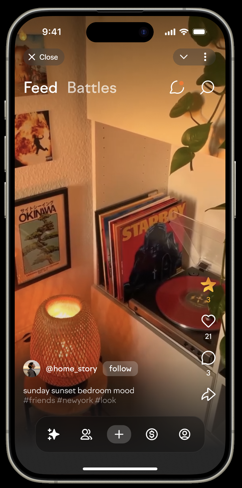
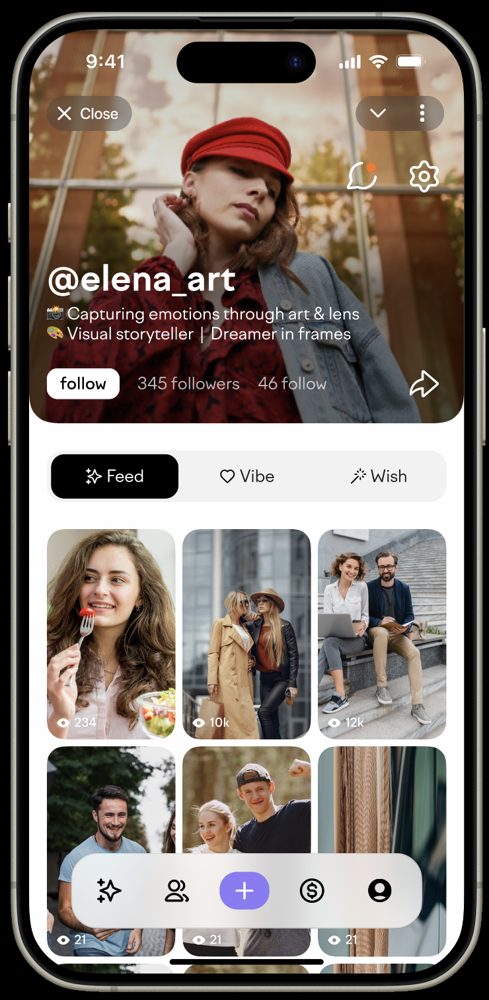

# Photon — Telegram Mini App frontend

Photon is a photo-sharing social app built as a Telegram Mini App.

This repository contains its archived frontend source code. The project is no longer actively maintained.

## Hackers League award

Photon was developed in part during **TON Society’s Hackers League Hackathon, Winter 2024**. Our team took **3rd place in the Social & Utility track** and received a **$25,000 prize package**: $15,000 in cash and $10,000 in Telegram advertising credits.

[Official winners announcement](https://t.me/toncommunitychannel/780)

## Product preview

<table>
  <tr>
    <td align="center"></td>
    <td align="center"></td>
  </tr>
  <tr>
    <td align="center">Photo feed</td>
    <td align="center">Creator profile</td>
  </tr>
</table>

These previews show the original product design. The public snapshot uses system fonts and has its original service integrations disconnected.

## App features

- Share photos with captions in a full-screen feed.
- Like, comment on, and share posts.
- Create a profile, follow other people, and browse friends’ photos.
- Organize personal photo collections in a Vibelist.
- Crop and edit photos before publishing.
- Invite friends and earn in-app rewards by completing tasks.
- Connect a TON wallet.
- Use the app in English or Russian.

## Technology

| Area             | Stack                                   |
| ---------------- | --------------------------------------- |
| Application      | Next.js App Router, React, TypeScript   |
| Styling          | Tailwind CSS                            |
| Server state     | TanStack Query                          |
| Client state     | Zustand                                 |
| Telegram         | Telegram Mini Apps SDK                  |
| Wallet interface | TON Connect                             |
| Localization     | next-intl                               |
| Motion           | React Spring, Framer Motion, Rive       |
| Checks           | Jest, Testing Library, ESLint, Prettier |

## Code map

```text
src/
├── app/          # App Router, localized routes, global styles
├── api/          # Request client, service modules, query hooks
├── components/   # Product screens and shared UI
├── hooks/        # Interaction and lifecycle hooks
├── i18n/         # Localization configuration and messages
├── providers/    # Telegram, query, wallet, and UI providers
├── store/        # Zustand application state
└── utils/        # Media, storage, and platform helpers
public/assets/    # Product visuals and animations
docs/images/      # Product previews
```

## Local inspection

Use Node.js 20+ and Yarn 1.22.

```bash
git clone https://github.com/KhristenkoE/photon-frontend.git
cd photon-frontend
yarn install --frozen-lockfile
yarn dev
```

Open [localhost:3000](http://localhost:3000). Development mode provides a minimal Telegram environment mock for inspecting the interface. It does not supply a backend or make authenticated product flows functional.

No bot token or production credentials are required to install or build this snapshot. Optional configuration for connecting your own compatible services is documented in `.env-example`.

```bash
yarn types:check
yarn build
```

The historical Jest configuration is retained, but this snapshot contains no test cases.

## Archive status

This is a source archive, not a supported deployment template or a complete offline demo. Original deployment workflows, private invitations, telemetry destinations, advertising integration, and production service defaults have been removed. The historical dependency versions are retained; review and update them before any real deployment.

The original private repository and its Git history are not included. No open-source reuse license is granted by this archive; third-party assets remain subject to their respective rights.
